# SENTRA

**A Hierarchical Replanning Framework for Heterogeneous Multi-UAV Monitoring in Mountainous Environments**

<p align="center">
  
  
  
</p>

> SENTRA integrates sensor-aware task allocation, terrain- and wind-aware global planning, communication-aware evaluation, and dynamic local replanning for heterogeneous UAV monitoring in mountainous environments.

本项目研究复杂山地环境中的异构多无人机监测规划问题，将传感器匹配、任务分配、地形约束、风场扰动、通信可靠性、动态障碍和在线重规划放进同一个闭环框架中。

## Research focus / 研究重点

Multi-UAV monitoring in mountainous areas is not only a path-planning problem. A useful mission plan must answer several coupled questions:

- Which UAV can satisfy the sensing requirements of each task?
- In what order should heterogeneous monitoring tasks be executed?
- How should terrain, wind and communication risk affect a global reference path?
- How should a UAV react when the local environment changes during flight?
- When should a local disturbance trigger higher-level replanning?

山地监测任务同时受到传感器能力、任务优先级、时间窗、DEM 地形、风场、障碍物、通信链路和无人机间隔约束的影响。因此，SENTRA 不把任务分配、全局路径和动态执行割裂开，而是通过跨层反馈形成一个分层重规划系统。

## What is SENTRA? / SENTRA 框架

<p align="center">
  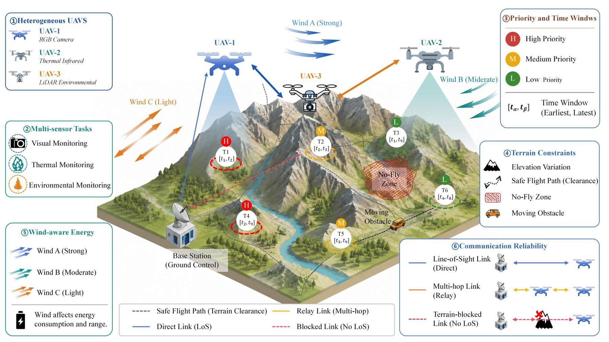
</p>

SENTRA stands for **Sensor-Network-Terrain-aware Hierarchical Replanning Framework**. Its three planning layers are:

1. **Mission layer - SCF-NSGA-II**: sensor-compatible task allocation and sequencing under sensing utility, energy, time-window and communication objectives.
2. **Static global layer - QLPSO**: reference-path generation with terrain clearance, wind-aware energy, communication reliability and path smoothness.
3. **Dynamic local layer - Adaptive DWA**: rolling trajectory correction using local obstacle, wind, communication and reference-path states.

<p align="center">
  
</p>

The key design principle is **execution feedback**: segment-level flight time, energy, communication outage and path feasibility are returned to the task layer instead of being replaced by distance-only surrogates.

核心思想是“执行反馈”：全局路径和动态执行产生的飞行时间、能耗、通信中断和可行性信息，会反馈到任务分配层，从而减少任务决策与实际路径执行之间的不一致。

## Method pipeline / 方法流程

### 1. Sensor-constrained task allocation / 传感器约束任务分配

<p align="center">
  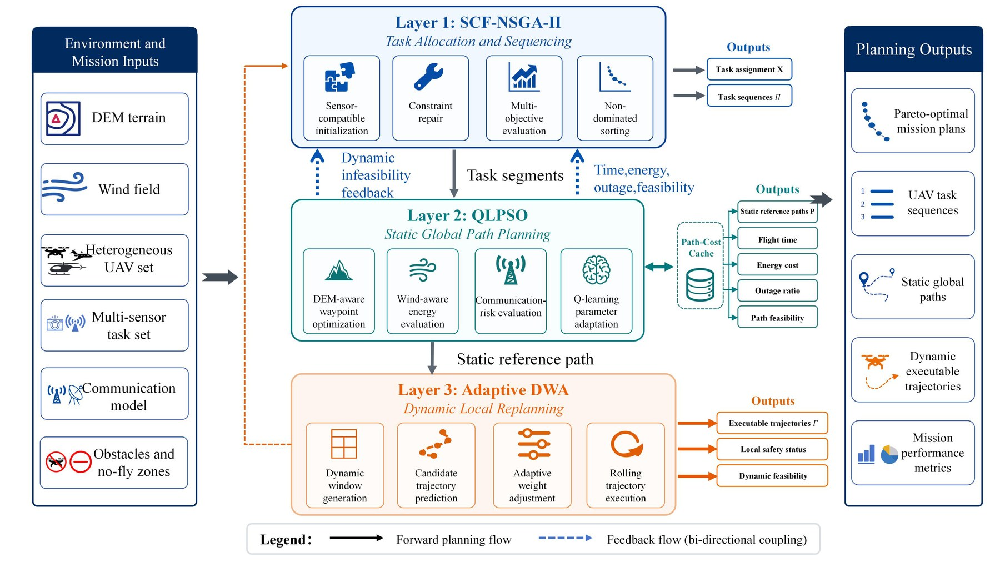
</p>

SCF-NSGA-II uses a hybrid chromosome containing UAV assignments and within-UAV order keys. The implementation includes sensor compatibility repair, sensing-quality constraints, battery/load surrogate repair, constraint domination, non-dominated sorting, crowding distance and feasible Pareto-solution selection.

### 2. Terrain- and wind-aware global planning / 地形与风场感知全局规划

<p align="center">
  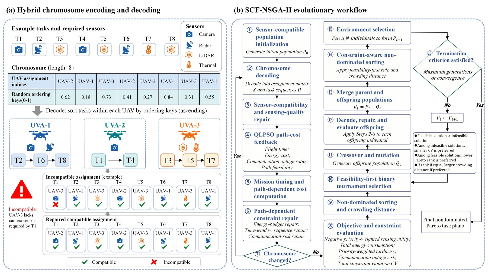
</p>

QLPSO is implemented as a Q-learning-inspired parameter-adaptive particle swarm optimizer. It generates static reference paths between adjacent monitoring tasks while evaluating path length, terrain risk, wind-aware energy, communication-related risk and smoothness.

QLPSO 在这里不是一个独立学习导航策略，而是一个带有 Q-learning 参数自适应机制的 PSO 全局路径规划器。它为相邻监测任务生成静态参考路径，并综合评价路径长度、地形风险、风场能耗、通信风险与平滑性。

### 3. Adaptive local execution / 自适应局部动态执行

<p align="center">
  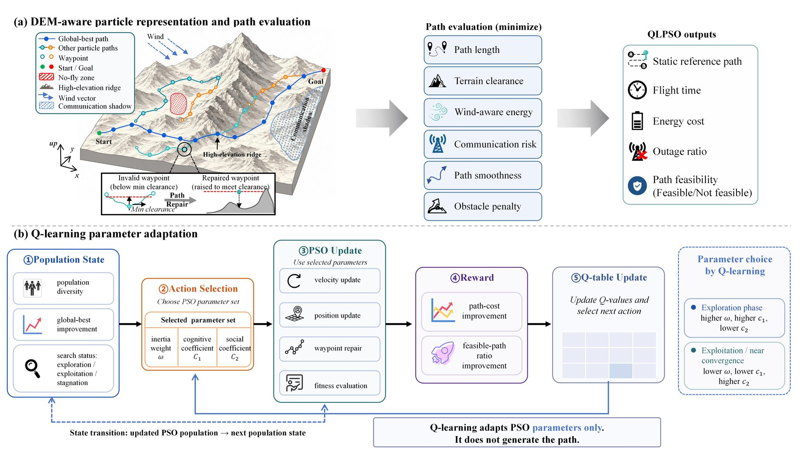
</p>

Adaptive DWA evaluates candidate local trajectories using goal progress, reference-path deviation, obstacle clearance, terrain clearance, wind cost, communication risk and velocity smoothness. The weights adapt to the current local risk state.

<p align="center">
  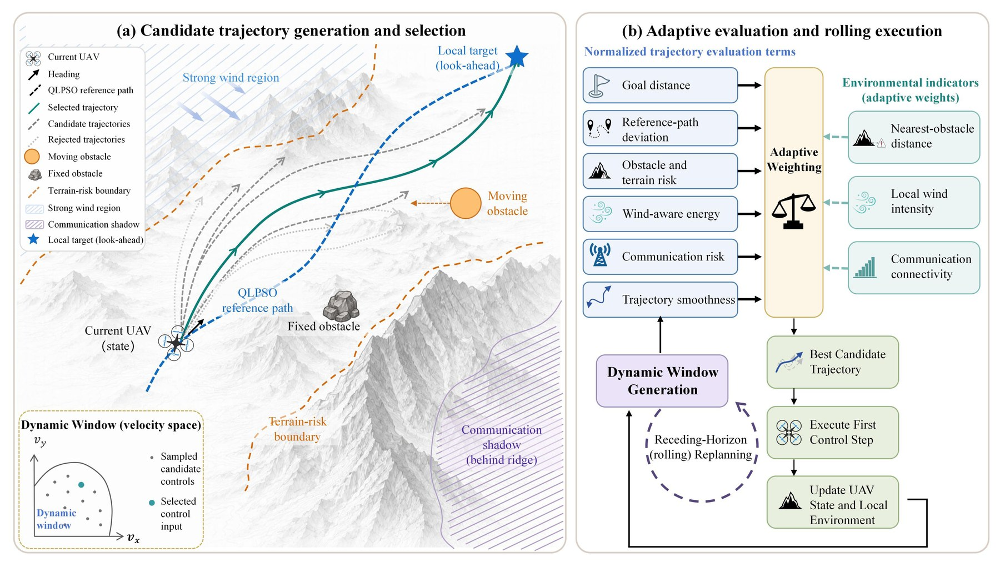
</p>

### 4. Event-triggered hierarchical recovery / 事件触发的分层恢复

When a local disturbance cannot be handled adequately by short-horizon execution, SENTRA can rebuild the remaining-task planning problem and replan affected downstream segments. This separates short-horizon safety correction from higher-level mission recovery.

当局部扰动已经超出短时域局部调整能力时，SENTRA 可以重新构造剩余任务问题，对受影响的后续路径段进行高层重规划，实现“局部快速修正 + 高层任务恢复”的分工。

## Experimental evidence / 实验结果

The paper evaluates SENTRA in DEM-based mountainous scenarios with five heterogeneous UAVs and progressively increasing monitoring loads. The experiments are simulation-based and focus on task feasibility, path quality, energy, communication, dynamic safety and replanning behavior.

### 6.2 Dynamic multi-UAV monitoring / 动态多无人机监测

Three cases use the same mountainous terrain and five UAVs, while increasing task count, dynamic obstacles and wind disturbance intensity:

| Case | Tasks | Moving obstacles | Main purpose |
|---|---:|---:|---|
| Case 1 | 20 | 1 | Basic dynamic execution |
| Case 2 | 25 | 2 | Moderate disturbance adaptation |
| Case 3 | 40 | 4 | High-load multi-disturbance stability |

<p align="center">
  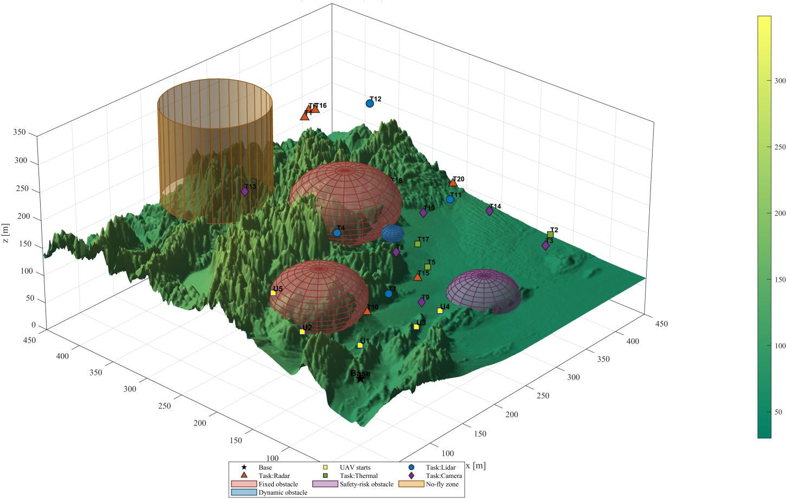
  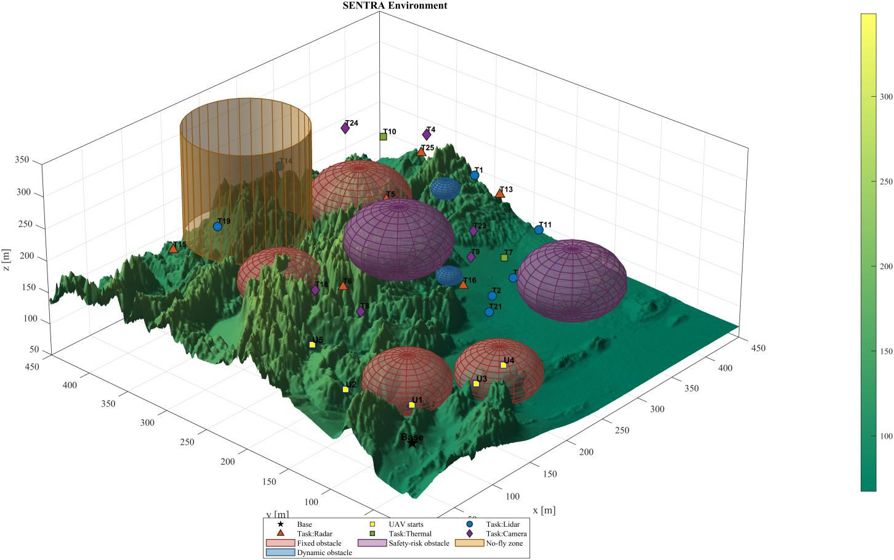
  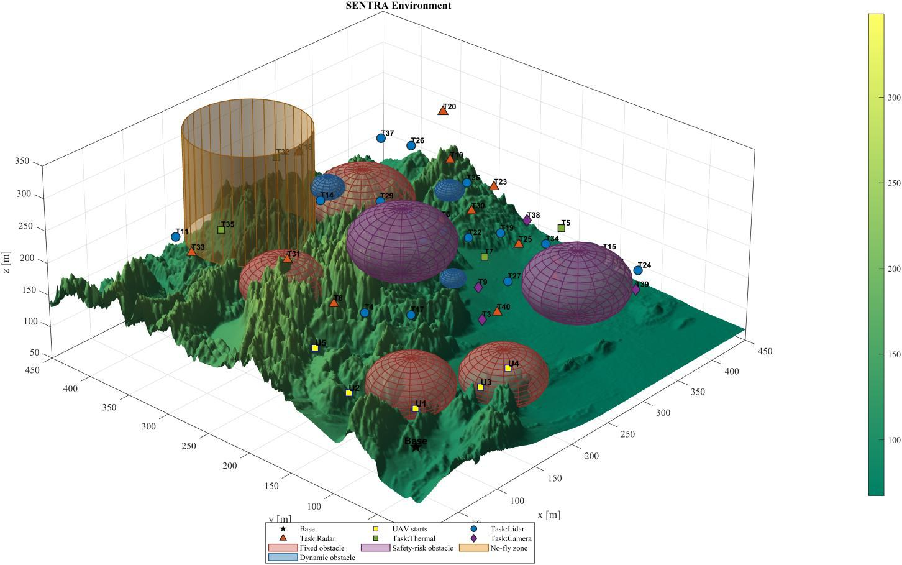
</p>

QLPSO first generates static reference paths; Adaptive DWA then performs rolling local corrections during execution.

<p align="center">
  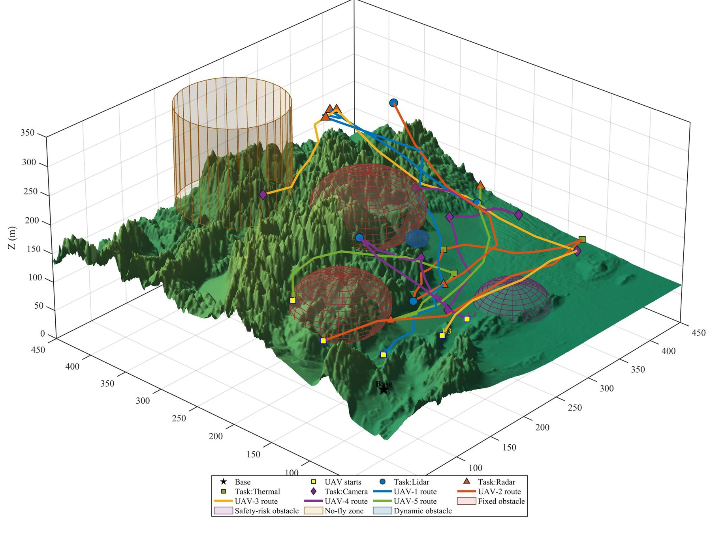
  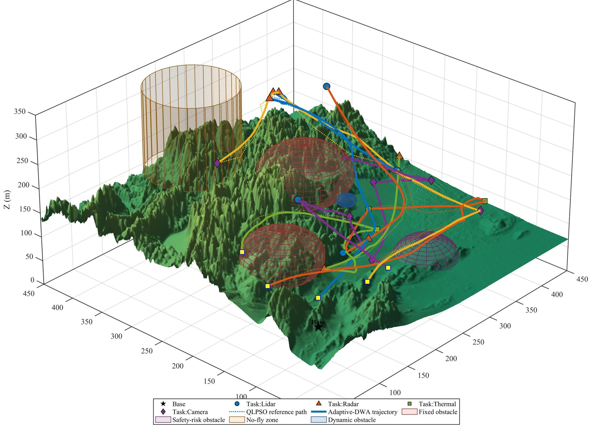
  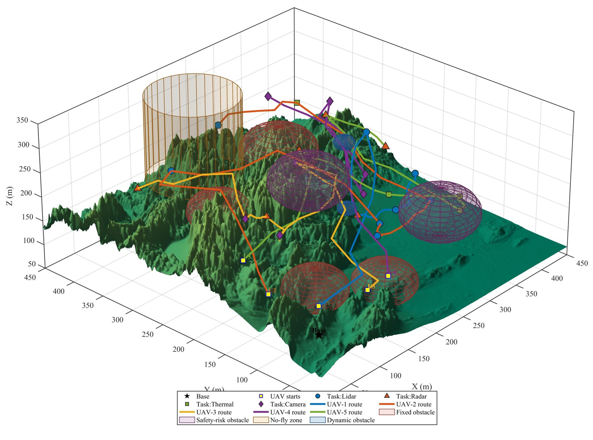
</p>

Reported results across the three cases:

| Indicator | Case 1 | Case 2 | Case 3 |
|---|---:|---:|---:|
| Sensor-compatible tasks | 20/20 | 25/25 | 40/40 |
| Statically feasible path segments | 20/20 | 25/25 | 40/40 |
| Dynamic task completion | 100% | 100% | 100% |
| Dynamic safety violations | 0 | 0 | 0 |
| Minimum inter-UAV separation | 22.25 m | 24.49 m | 22.41 m |
| Adaptive-DWA replanning events | 23 | 25 | 32 |
| Static path length | 4318.44 m | 4689.59 m | 7829.36 m |
| Dynamic path length | 4081.69 m | 4260.97 m | 7215.86 m |

Relative to the static QLPSO references, the final dynamic trajectories reduced path length by 5.48%, 9.14% and 7.84%, and reduced energy consumption by 0.31%, 5.21% and 11.96% in Cases 1-3, respectively.

## 6.3 Global-planner comparison and Adaptive-DWA ablation

The global-planner comparison uses the same Case 2 task assignment, environment, path discretization, constraints and random seeds for PSO, CLPSO, APSO and QLPSO. Each method is repeated 30 times under a common budget.

<p align="center">
  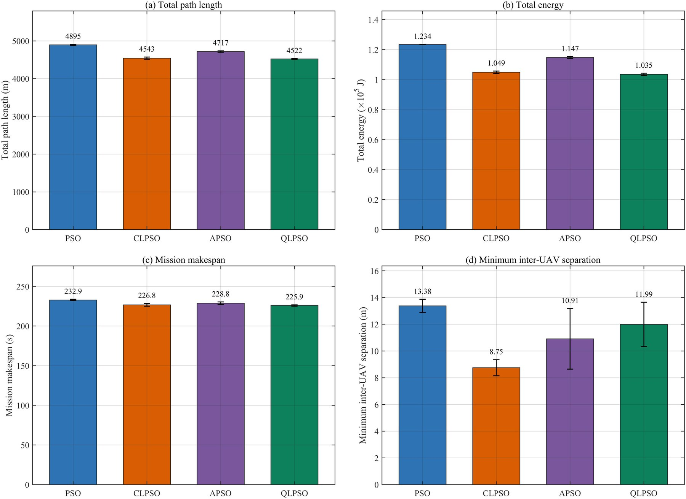
</p>
<p align="center">
  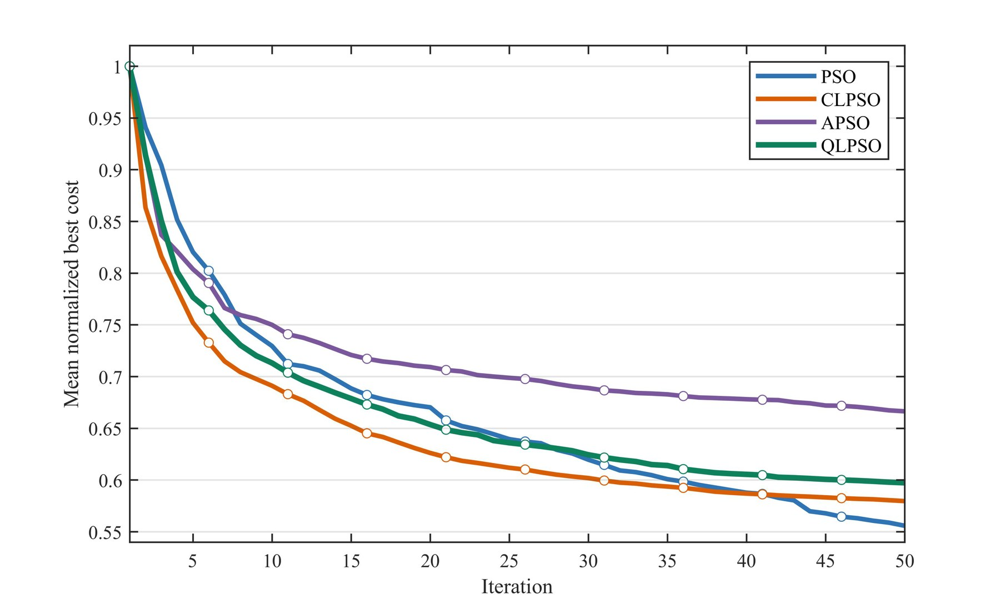
</p>

| Planner | Total path length | Energy (x10^5 J) | Makespan |
|---|---:|---:|---:|
| PSO | 4895.21 m | 1.234 | 232.93 s |
| CLPSO | 4543.33 m | 1.049 | 226.76 s |
| APSO | 4717.36 m | 1.147 | 228.85 s |
| **QLPSO** | **4521.96 m** | **1.035** | **225.91 s** |

Under this experimental setting, QLPSO achieved the lowest sample means for total path length, energy consumption and mission makespan. Compared with PSO, it reduced path length by 7.62% and energy consumption by 16.12%.

Adaptive DWA was compared with Original DWA using the same reference paths, dynamic obstacles, wind field and safety margins.

<p align="center">
  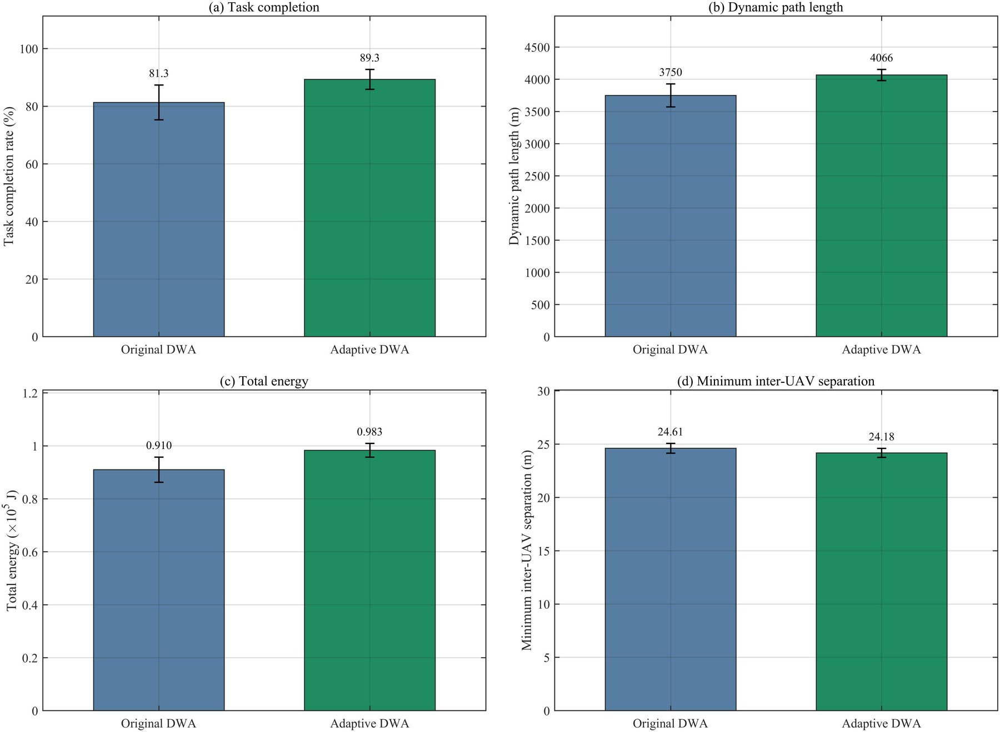
</p>

Adaptive DWA increased mean overall task completion from 81.33% to 89.33% and high-priority task completion from 76.19% to 85.71%. The improvement came with more conservative local corrections and higher path/energy cost, which is an explicit safety-versus-efficiency trade-off rather than a universally lower-cost result.

## 6.4 Emergency-triggered hierarchical replanning

The emergency experiment compares two strategies:

- **Route A - event injection only**: retain the original global reference path and rely on Adaptive DWA for local response;
- **Route B - event-triggered hierarchical replanning**: invoke QLPSO to rebuild affected downstream reference segments after an event is accepted.

Two event types are studied: a sudden path blockage and a localized wind-speed surge.

### Sudden path blockage / 突发路径阻断

<p align="center">
  
  
</p>

Hierarchical replanning reconstructed the affected segment while preserving the mission completion rate and dynamic safety constraints. The event-level replan added only a small operational cost in the paired comparison.

### Localized wind surge / 局部风场突变

<p align="center">
  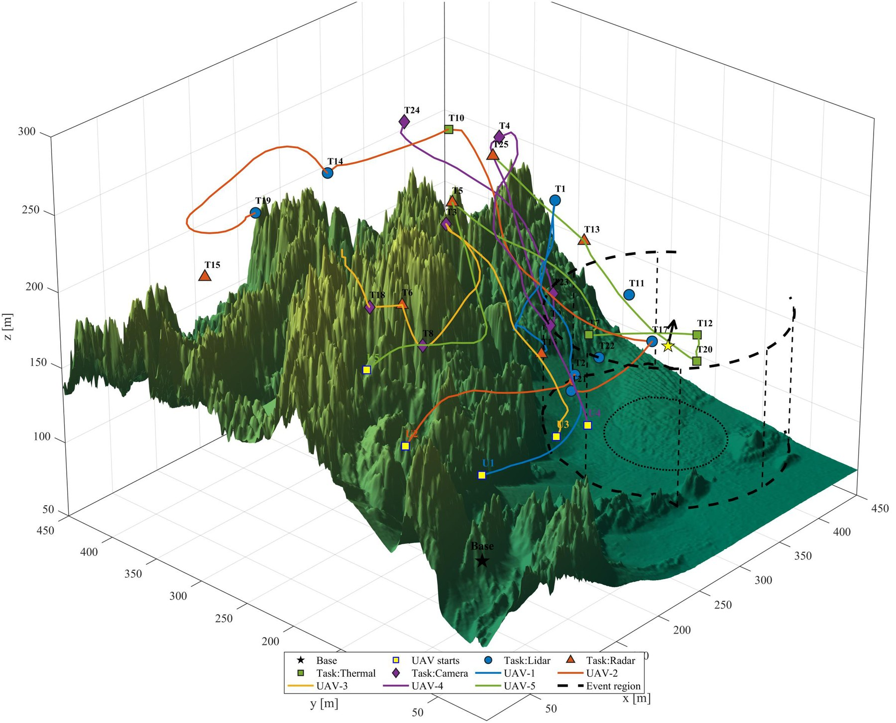
  
</p>

For the localized wind-surge event, event-triggered hierarchical replanning reduced cumulative wind risk from 22.15 to 2.29, an average reduction of 89.66%, while increasing dynamic path length and energy consumption by less than 1% in the paired experiment.

## Code map / 代码对应关系

The research code is currently maintained as three local experiment packages corresponding to the paper sections. They are being prepared for later upload to this GitHub repository.

| Paper section | Local package | Main focus |
|---|---|---|
| 6.2 | `MDPI代码-返修用/6.2/experiment6.2 v1.0` | Dynamic multi-UAV planning, static QLPSO paths, Adaptive DWA execution and task-load cases |
| 6.3 | `MDPI代码-返修用/6.3/experiment6.2 v1.0` | Global-planner comparison, dynamic execution comparison and Adaptive-DWA ablation |
| 6.4 | `MDPI代码-返修用/6.4/sentra64_mod` | Event-triggered hierarchical replanning, path blockage, wind surge and sensitivity analysis |

Representative entry points in the local codebase include:

```text
6.2: RUN_ME.m, RUN_QUICK_STATIC.m, main_SENTRA_v3.m
6.3: RUN_EXPERIMENT6_3.m, RUN_EXPERIMENT6_3_QUICK.m, main_SENTRA_v3.m
6.4: run_experiment64.m, RUN_EXPERIMENT6_4.m, RUN_REVISION_SENSITIVITY_ONLY_6RUNS.m
```

The packages also contain separate modules for `allocation`, `environment`, `global_planner`, `local_planner`, `simulation`, `metrics`, `visualization`, `cache` and `tests`. The GitHub code links will be added after the three packages are uploaded and their final folder names are confirmed.

## Minimal run guidance / 最小运行说明

The code is MATLAB-based. The local packages target MATLAB R2023b.

```matlab
% Start from the selected experiment package
startup_SENTRA

% Quick validation
run_v3_smoke_tests

% Main integrated chain
RUN_ME
```

For section-specific experiments, use the corresponding `RUN_EXPERIMENT6_2*`, `RUN_EXPERIMENT6_3*` or `RUN_EXPERIMENT6_4*` script. Output figures and summary tables are written to the package-specific output/results folders.

## Scope and limitations / 研究范围与局限

The manuscript and code are intended as a simulation-based research record. The following modelling boundaries are explicit:

- the wind field is an analytical engineering model rather than CFD;
- QLPSO is a Q-learning-inspired parameter-adaptive PSO, not an independently trained navigation policy;
- Adaptive DWA is a trajectory-level kinematic planner, not a full 6-DOF flight controller;
- SCF-NSGA-II uses cached QLPSO feedback during population search and full QLPSO for the selected solution;
- the current dynamic execution architecture evaluates individual UAV executions on a common clock and checks fleet separation, but does not claim a fully coupled multi-UAV local controller;
- the reported results are simulation results; hardware-in-the-loop and field validation remain future work.

## Paper / 论文

**SENTRA: A Hierarchical Replanning Framework for Heterogeneous Multi-UAV Monitoring in Mountainous Environments**  
Authors: Shiyang Li, Weiwei Guo, Jianzhe Feng, Zehao Hou and Zhen Tian.

Paper / DOI / preprint link: **to be added**

## Citation / 引用

```bibtex
@article{li_sentra,
  title   = {SENTRA: A Hierarchical Replanning Framework for Heterogeneous Multi-UAV Monitoring in Mountainous Environments},
  author  = {Li, Shiyang and Guo, Weiwei and Feng, Jianzhe and Hou, Zehao and Tian, Zhen},
  journal = {Sensors},
  year    = {2026},
  note    = {Manuscript version; bibliographic details to be updated}
}
```

## Contact / 联系方式

```text
Name: [Your Name]
Email: [your.email@example.com]
Research interests: multi-UAV systems, mountainous monitoring, task allocation, path planning, dynamic replanning
```

## License

No open-source license has been selected yet. Until a license is added, please contact the author before redistribution or commercial use.
